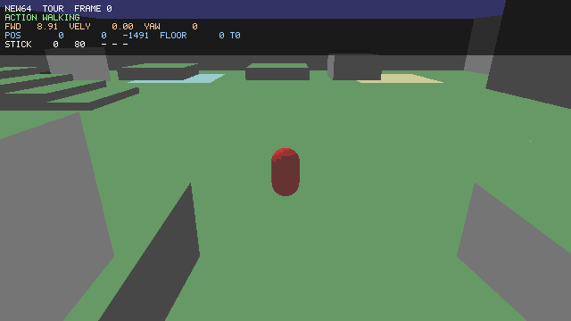

# new64

A custom 3D engine built around one goal: reproduce Super Mario 64's movement
model exactly, and be able to host movement code from a decompilation project
**unmodified**.

The character is a capsule. The level is a test rig. Everything that matters
here is how it moves.



## Why this is structured the way it is

The interesting realisation behind this project is that a decomp's
`mario_actions_airborne.c` contains almost no physics. It reads a struct, calls
four or five functions, and sets a state. All the actual behaviour lives
*underneath* it:

```
                 mario_actions_{airborne,moving,stationary,...}.c
                        the state machine  --  REPLACEABLE
    ---------------------------------------------------------------------
      perform_air_step   perform_ground_step   set_mario_action   sins/coss
      find_floor         find_wall_collisions  atan2s             apply_gravity
                        the substrate  --  THE REAL WORK
```

So hosting that code is not a matter of stubbing out an API. It means
reproducing the substrate's *behaviour* precisely — including the parts that a
modern engine would never do on purpose:

- collision query positions are truncated to `s16`, so movement happens on an
  integer lattice;
- motion is applied in four quarter-steps per frame, each doing a full collision
  query, and the early-exit conditions differ between them;
- a floor up to 78 units *above* your feet still counts as the floor;
- wall pushout accumulates across every wall hit, but each wall is tested
  against the *original* position, not the corrected one;
- `sins`/`coss` are 4096-entry table lookups, so the low 4 bits of every angle
  are discarded before any trig happens.

Change any one of those and slotted-in movement code compiles, runs, looks
roughly right, and is subtly wrong in ways that only show up frame-by-frame.
They are reproduced deliberately and annotated at each site in
`engine/src/m64_surface.c` and `sm64/src/game/mario_step.c`.

## What's implemented

Ground: walking with SM64's exact acceleration curve, running, the turnaround
state, skid braking, deceleration, crouching, crawling, butt/stomach/dive/crouch
slides, slope physics with all four slipperiness classes.

Air: single/double/triple jump chain, backflip, side flip, long jump, wall
kicks (with the real two-frame window), dive, ground pound, slide kick, jump
kick, freefall, rollouts, knockback.

Automatic: ledge grabbing and climbing, ceiling hanging.

Not implemented: swimming, and anything needing objects (grabbing, riding,
enemies). The demo level has no water and no objects. `perform_water_step()`
exists and works, so a submerged implementation can be slotted in.

## Windows: just run it

Prebuilt x64 binaries: **[dist/new64-windows-x64.zip](dist/new64-windows-x64.zip)**

Unzip and double-click `new64_play.exe`. Three files, no installer, nothing to
copy alongside them — the executables import only DLLs that ship with Windows.
They are unsigned, so SmartScreen will warn; "More info" → "Run anyway", or
build from source below.

**Use a gamepad if you have one.** An Xbox-style controller is picked up
automatically via XInput, and this is a fidelity matter rather than comfort: the
stick response is quadratic, so half deflection gives a quarter speed. The
entire low end of that curve — creeping, walking, the tiptoe — is unreachable on
a keyboard, which can only ever report full deflection.

## Build and run

Needs a C11 compiler and CMake ≥ 3.13. **No external dependencies** — deflate,
PNG and GIF are all implemented in-tree. X11 headers are optional, for the
interactive front-end on Linux.

```sh
cmake -S . -B build -DCMAKE_BUILD_TYPE=Release
cmake --build build -j
```

**Play it** (needs a display):

```sh
./build/new64_play
```

| Key | Action |
| --- | --- |
| `WASD` / arrows | move (analog stick) |
| `Space` | A — jump |
| `J` | B — punch, or dive at speed |
| `K` / `Shift` | Z — crouch, ground pound, long jump |
| `Q` / `E` | rotate camera |
| `R` | reset |
| `Esc` | quit |

Try: run and tap `Space` three times on landing for the jump chain; hold `K`
then `Space` for a backflip; run, tap `K`, then `Space` for a long jump; run at
a wall, jump, and tap `Space` on contact for a wall kick.

**Run it headlessly** — renders to PNG and animated GIF, and prints a per-frame
state trace. This is how the engine is actually verified:

```sh
./build/new64_headless --script jumpchain --out out
./build/new64_headless --list          # all built-in demos
```

Built-in demos: `walk`, `jumpchain`, `jumpheight`, `longjump`, `wallkick`,
`wallshafts`, `turnaround`, `sideflip`, `backflip`, `slopes`, `ice`, `dive`,
`groundpound`, `ledgegrab`, `tour`.

Each one isolates a single mechanic and its script explains what to expect. A
trace line looks like:

```
   31 JUMP   pos=(0.00 48.97 -887.72) vel=(0.00 44.97 29.05) fwd=29.05 yaw=0 floorY=-0.00 floorT=0 [JUMP] [VOX_JUMP]
```

The bracketed tags are sound cues the state machine raised that frame. There is
no audio engine — the cues are recorded instead of played, which makes "the
landing was recognised on frame 56" directly checkable.

**Cross-compile for Windows** from Linux (`apt install mingw-w64`, nothing else):

```sh
./scripts/build-windows.sh        # builds, checks DLL imports, writes the zip
```

or by hand:

```sh
cmake -S . -B build-win -DCMAKE_TOOLCHAIN_FILE=cmake/mingw-w64-x86_64.cmake \
      -DCMAKE_BUILD_TYPE=Release
cmake --build build-win -j
```

**Test it:**

```sh
./build/new64_tests
```

164 assertions covering the substrate (angle quantisation, s16 truncation, the
floor buffer, wall pushout), the movement constants (every jump's launch
velocity, terminal velocity, the walk speed cap, slope class thresholds, the
jump chain, the wall kick window), and the level's own geometry — that every
ramp is a standable slope rather than an inside-out ceiling, and every landmark
has ground under it.

Two of those deserve a note, because both exist due to a test that was worse
than useless:

- **The stick-to-screen mapping is checked against rendered pixels.** The
  obvious assertion — "stick right increases world X" — is only correct if you
  already know the renderer's handedness. Get that wrong and the test and the
  code agree with each other while the controls are inverted for whoever is
  holding the pad, which is exactly what happened here. The test now renders a
  frame from a fixed viewpoint and checks which side of the image the player
  moved toward.
- **Straight running must not drift.** The camera auto-follows the player's
  facing, so any mismatch between what the stick asked for and where the camera
  thinks "behind" is gets fed back every frame. Holding forward for 120 frames
  has to stay within an eighth of a turn.

The Linux and Windows builds are verified to produce **byte-identical** output:
all 164 assertions pass on both, and every demo's state trace and every rendered
PNG and GIF match exactly across platforms. That is what `-ffp-contract=off` and
the committed sine table are for — the physics must not depend on the compiler.

## Slotting in decomp code

Drop `.c` files into `slot/`. Any file there replaces the reference
implementation with the same basename automatically — no build edits.

```sh
cp path/to/decomp/src/game/mario_actions_airborne.c slot/
cmake --build build -j     # "new64: slot/ overrides mario_actions_airborne.c"
```

The headers those files `#include` already exist at the paths they expect
(`sm64.h`, `types.h`, `mario.h`, `mario_step.h`, `engine/math_util.h`,
`engine/surface_collision.h`, `audio/external.h`, and so on).

See **[docs/SLOTTING_IN_DECOMP.md](docs/SLOTTING_IN_DECOMP.md)** for what the
shims cover, what to expect file by file, and the one place where real asset
data is still needed for full fidelity (animation frame counts).

## Layout

```
engine/    substrate: math, collision, level, camera, renderer, PNG/GIF.
           Knows nothing about the player. Namespaced m64_*.
sm64/      the hosted layer: the movement state machine and the ABI it
           expects. This is the part decomp sources replace.
  include/   sm64.h, types.h, and the rest of the vocabulary
  src/game/  the reference movement implementation
  src/shims/ inert stand-ins for audio, camera, save, objects
slot/      drop decomp .c files here
app/       front-ends (headless runner, X11) and the demo host
tests/     the test suite
tools/     the sine table generator
```

`docs/ARCHITECTURE.md` explains the split and the fidelity quirks in detail.

## Provenance

All code here was written from scratch for this project. The repository contains
no code from Nintendo or from any decompilation project, and none is downloaded
or vendored by the build.

What it *does* reproduce is an interface — struct field names, function
signatures, and constant names — because that is what interoperating with such
code requires, along with the numeric constants of the movement model itself.
Bringing in decompiled sources is a choice you make by putting files in `slot/`,
and the licensing and legal position of doing so is yours to evaluate.
